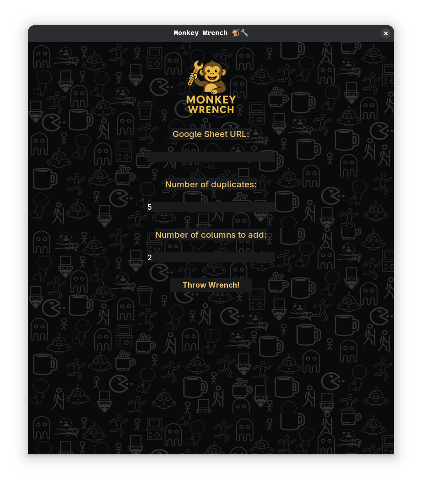

# 🐒 Monkey Wrench

**Monkey Wrench** is a chaotic little Python tool I made to mess with Google Sheets — mostly for testing deduplication tools and stress-testing systems.

---

## 🛠 Features

- 🔗 Connects to any public or shared Google Sheet
- 🔁 Duplicates random rows
- ➕ Injects random extra columns from a pool of "business-sounding" junk
- 🐒 Animates a monkey chucking a wrench (yes, really)
- 🔊 Plays monkey noises for maximum chaos
- ☁️ Pushes the results right back into the same Google Sheet

---

## 🧰 Requirements

- Python 3.10–3.13
- Works on Linux, Windows, and (probably) macOS
- Tested on Arch Linux with Python 3.13
- Tested on Windows 11 with Python 3.13
- pip install gspread google-auth pygame Pillow
- Note: On Arch linux to get Tkinter and SDL2 dependencies: sudo pacman -S tk sdl2 sdl2_mixer

---

## ▶️ To Get EXE

**Windows Only**
pyinstaller --noconfirm --onefile --windowed --icon=monkey.ico \
  --add-data "monkey.wav;." \
  --add-data "monkey_logo.png;." \
  --add-data "grid_texture.png;." \
  --add-data "monkey.ico;." \
  monkey_wrench_gui.py

**Linux Support**
Just run it like any other Python script: python monkey_wrench_gui.py

---

## 🌐 Google Sheets Setup

- Go to Google Cloud Console
- Enable Google Sheets API and Drive API
- Create a Service Account and download service_account.json
- Share your target sheet with that service account’s email
- Paste the sheet URL into Monkey Wrench and go bananas 🐒
